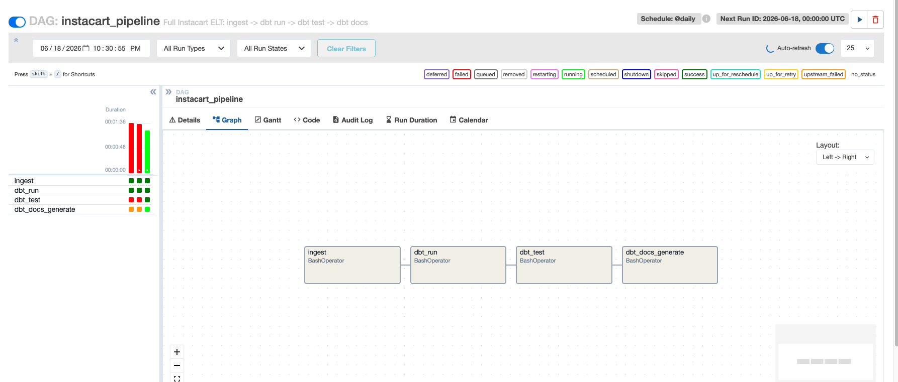
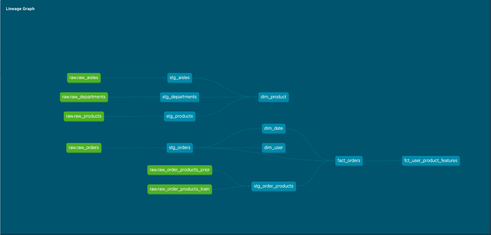

# Instacart Data Pipeline: A Modern ELT Stack for Transaction-Driven Analytics

An end-to-end data engineering pipeline built on the Instacart Market Basket dataset, modeling grocery transaction behavior into a dimensional star schema and an ML-ready feature mart. Built with Python, Snowflake, dbt, and Apache Airflow.

## Why this dataset, why this shape

This project models grocery basket and reorder behavior — products, departments, aisles, and per-user purchase patterns — the same domain language as retail transaction analytics: which products drive repeat purchases, how basket composition varies by time of day, and which user-product relationships are strong enough to act on. The dataset's scale (3.4M orders, 33.8M order-product line items, 206K users) and genuine messiness made it a realistic target for a production-shaped pipeline rather than a toy example.

## Architecture

```
Kaggle CSVs
    │
    ▼
Python ingestion (ingestion/load_to_snowflake.py)
    │  zero transformation, exact source fidelity
    ▼
Snowflake RAW schema (6 tables)
    │
    ▼
dbt staging models (5 models)
    │  type casting, null handling, source reconciliation
    ▼
dbt mart models — star schema (4 models) + feature mart (1 model)
    │  dim_date, dim_product, dim_user, fact_orders, fct_user_product_features
    ▼
Orchestrated end-to-end by Apache Airflow (Docker Compose)
    ingest → dbt run → dbt test → dbt docs generate
```

## Data model

### Grain definitions

Every table's grain was decided explicitly, not left implicit:

| Table                       | Grain                                               | Rows (full dataset) |
| --------------------------- | --------------------------------------------------- | ------------------- |
| `dim_date`                  | One row per (day-of-week, hour-of-day) combination  | 168                 |
| `dim_product`               | One row per product, with aisle/department resolved | 49,688              |
| `dim_user`                  | One row per user                                    | 206,209             |
| `fact_orders`               | One row per order-product line                      | 33,819,106          |
| `fct_user_product_features` | One row per (user, product) pair ever ordered       | 13,863,746          |

**`dim_date` is not a conventional calendar date dimension.** The Instacart dataset is anonymized to day-of-week and hour-of-day only — no real calendar dates exist anywhere in the source. This table is a "time-of-week bucket" dimension: built by cross-joining all 7 days against all 24 hours to guarantee complete coverage (168 rows) regardless of which combinations any given sample of orders happens to contain, with derived attributes (day name, weekend flag, time-of-day bucket) computed once rather than recomputed downstream.

**`fact_orders`' unique key is a composite, not `order_id` alone.** A single order contains many products, so `order_id` by itself doesn't identify a unique row at this grain. The unique key is a surrogate hash of `(order_id, product_id)` — this distinction matters directly for the incremental materialization strategy below.

**`fct_user_product_features` exists as a separate mart from `dim_user`, deliberately.** `dim_user` holds stable, one-row-per-user descriptive attributes for general reporting. The feature mart holds behavioral signals (reorder rate, purchase recency, cart-position habits) at user-_product_ grain — the natural shape for an ML task like reorder prediction, where each row is a candidate (user, product) pair to score. Conflating these into one table would require either arrays/structs or picking one product per user; keeping them separate is the dimensionally correct choice.

## Transformation decisions

A few choices made deliberately during staging, each with a concrete reason:

- **`order_hour_of_day` is cast from a zero-padded string to an integer explicitly in staging**, not left to type inference. The raw layer preserves the source's exact string form (`"08"`); staging decides it's fundamentally a numeric, comparable quantity and casts it on purpose.
- **`days_since_prior_order` is left NULL on every user's first order, by design** — not coalesced to 0. A first order has no prior order to measure against; treating that as "0 days" would be factually wrong, not just a stylistic choice. This also shapes the `not_null` test coverage (see below) and the `AVG()` aggregation in `dim_user` (Snowflake's `AVG()` correctly and silently excludes these NULLs).
- **Two raw source files (`order_products__prior`, `order_products__train`) are explicitly unioned in staging**, not silently merged at ingestion. This split exists purely because of the dataset's original Kaggle ML-competition framing — it has no business meaning here — but the raw layer preserves exact source fidelity, so the reconciliation happens visibly, in a tested staging model, rather than being baked into the ingestion script.

## Data quality testing

**69 dbt schema tests across all 10 models** — `not_null`, `unique`, `accepted_values`, `relationships`, plus `dbt_utils.unique_combination_of_columns` (composite key uniqueness) and `dbt_utils.accepted_range` (bounding `reorder_rate` to [0,1]).

One test caught a genuine gap during development: an `accepted_values` test on `eval_set` initially listed only `'prior'` and `'train'`, based on what an early manual inspection happened to show. The test failed against the full dataset, revealing a third value — `'test'` — that exists in `orders.csv` but deliberately has zero corresponding rows anywhere in `order_products`, since Kaggle never released that split's line items (doing so would have revealed their competition's answer key). The test suite caught what manual inspection missed.

## Incremental materialization

`fact_orders` uses dbt's `is_incremental()` pattern, keyed on the surrogate `order_product_key`, filtered on `order_id` as a high-water mark:

```sql

where order_id > (select coalesce(max(order_id), 0) from {{ this }})

```

At 33.8M rows, full-refreshing this table on every run is the wrong approach. Verified correctness with a two-run test: a `--full-refresh` build produced the correct full row count, and an immediate subsequent run with no new source data produced `SUCCESS 0` — confirming the incremental filter correctly recognized there was nothing new to process, rather than redundantly rebuilding the table.

`order_id` was chosen as the high-water mark specifically because this dataset has no real timestamps — only day-of-week and hour-of-day, which aren't monotonically increasing over time and can't serve as a recency filter. `order_id`-as-proxy-for-recency is an assumption about how the source system assigns IDs, not a guarantee; in a real production source this would be confirmed with the system's owner rather than assumed.

## Orchestration

A 4-task Airflow DAG (`dags/instacart_pipeline.py`), running via Docker Compose, orchestrates the full pipeline:

```
ingest → dbt_run → dbt_test → dbt_docs_generate
```

- Linear dependencies reflect genuine requirements — you can't test models before they're built, can't build models before raw data exists.
- `ingest` and `dbt_run` have retries configured (transient network/timeout failures); `dbt_test` intentionally has zero retries, since a test failure is a data quality signal that should surface immediately, not be silently retried away.
- dbt runs inside a custom Docker image (see `Dockerfile`) with `dbt-snowflake` installed at image build time — not via Airflow's `_PIP_ADDITIONAL_REQUIREMENTS` env var, which proved unreliable in practice (Airflow's own docs flag it as a development-only feature) and is exactly why a custom image is the production-correct approach.



## Lineage and documentation

Full column-level lineage, generated via `dbt docs generate`:



Raw sources flow through staging into the star schema and feature mart, with every model and column documented inline in `schema.yml` / `sources.yml`.

## Data governance

This dataset contains no PII — users and orders are identified only by anonymized integer IDs. See [`docs/DATA_GOVERNANCE.md`](docs/DATA_GOVERNANCE.md) for the full assessment and a set of concrete governance controls (masking policies, role-based access, retention windows) that would be appropriate in a production environment handling real customer transaction data.

## Project structure

```
instacart-pipeline/
├── ingestion/
│   ├── sample_dataset.py       # referentially-consistent sampling for fast iteration
│   └── load_to_snowflake.py    # raw CSV → Snowflake, zero transformation
├── dbt_instacart/
│   ├── models/
│   │   ├── staging/            # 5 models + sources.yml + schema.yml
│   │   └── marts/              # 5 models (4 star schema + 1 feature mart) + schema.yml
│   ├── dbt_project.yml
│   └── packages.yml
├── dags/
│   └── instacart_pipeline.py   # Airflow DAG
├── docker-compose.yml
├── Dockerfile                  # custom Airflow image with dbt baked in
├── docs/
│   ├── BUILD_LOG.md             # full decision log — every choice and bug, with reasoning
│   ├── DATA_GOVERNANCE.md
│   ├── lineage_graph.png
│   └── airflow_dag_success.png
└── data/raw_sample/             # gitignored — sampled CSVs for local iteration
```

## Running this locally

**1. Snowflake setup**

Create a warehouse, database, and `raw`/`analytics` schemas (see `docs/BUILD_LOG.md` for the exact DDL and reasoning).

**2. Environment variables**

```bash
export SNOWFLAKE_ACCOUNT='your_account.region.cloud'
export SNOWFLAKE_USER='your_username'
export SNOWFLAKE_PASSWORD='your_password'
export SNOWFLAKE_WAREHOUSE='instacart_wh'
export SNOWFLAKE_DATABASE='instacart_db'
export SNOWFLAKE_SCHEMA='raw'
```

**3. dbt profile**

Create `~/.dbt/profiles.yml` using `env_var()` for all credentials — see `docs/BUILD_LOG.md` for the exact format.

**4. Ingest data**

```bash
python3 ingestion/sample_dataset.py --n-users 5000   # fast local sample
python3 ingestion/load_to_snowflake.py --source data/raw_sample
```

**5. Run dbt**

```bash
cd dbt_instacart
dbt deps
dbt run
dbt test
dbt docs generate && dbt docs serve
```

**6. Run the full orchestrated pipeline via Airflow**

```bash
docker-compose build
docker-compose up airflow-init
docker-compose up airflow-webserver airflow-scheduler
# visit http://localhost:8080 (admin/admin), unpause and trigger instacart_pipeline
```

## What's documented elsewhere

`docs/BUILD_LOG.md` is a complete, chronological record of every decision made during this build — including bugs found, root causes, and fixes (a case-sensitivity issue from `write_pandas`, a zero-padding bug caught by direct data verification, three separate Docker/Airflow configuration issues each with a distinct real cause). It's written as both an engineering record and interview preparation material — every claim in this README traces back to a verified, logged result in that file.
